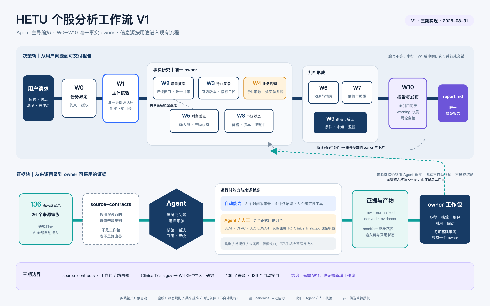

# 个股分析工作包架构导览

> 适用对象：`skills/hetu-stock-analysis` 的单只中国 A 股证据型研究
>
> 架构基线：[V1 三期实现](../../specs/2026-08-27-stock-analysis-workflow-v1-phase-3-implementation.md)（2026-08-31）
>
> 本文目的：说明 W0–W10 分别负责什么、从哪些信息形成判断、由谁拥有事实，以及它们如何汇入最终报告。本文是阅读导览，不替代工作包合同、来源合同或实际研究证据。

## 1. 一句话理解

这套架构把一次个股研究拆成十一份**事实所有权明确的工作包**：先确定任务和主体（W0–W1），再并行或交错收集公司、行业、财务和市场事实（W2–W5、W8），随后在这些事实约束下形成情景、估值和论点（W6–W9），最后只做汇总与两轮自检（W10）。

编号不是执行顺序，也不是由脚本驱动的流水线；主 Agent 按依赖、信息可得性和用户关注点编排。确定性脚本只能处理显式输入，不能选择来源、裁决冲突或替 Agent 形成结论。

可编辑源：[Kimi Design PPTD](../pics/stock-analysis-workflow/stock-analysis-workflow.pptd)；
矢量导出：[SVG](../pics/stock-analysis-workflow/stock-analysis-workflow.svg)。

先读上方决策轨：“先定边界 → 再查事实 → 后做判断 → 最后交付”。事实研究的五个包不是串行
队列；它们只需在 W1 主体核验后启动。再读下方证据轨：“来源目录 → 静态来源规则 → Agent
按用途选择 → 取得并登记证据 → 对应 owner 接纳”。虚线只表示静态规则、W2/W5 的共享基准或
回访条件，不表示后台自动执行。任何新证据命中回访条件时，受影响的下游包回到进行中，重新定稿
后才能通过 W10 前的关闭条件。

图中的 136 条来源记录是研究目录，不是 136 个自动接口。`source-contracts.md` 只是 Agent
按用途读取的静态规则，不是工作包、路由器或执行者；来源选择、冲突裁决和采用决定仍由 Agent
负责。三期已将 30 类信息分配给现有 W0–W10 的唯一 owner，或明确标为线索／暂不采用；这证明
无需新增 W11 或新工作流，不代表相关信息已经全部取得或闭合。

## 2. 共同的信息与产物架构

W1 唯一核验主体后，一次研究固定落在
`.hetu/research/<证券简称>-<标准证券代码>-<quick|standard|deep>-<任务时间>/`：

| 位置 | 作用 | 谁使用 |
| --- | --- | --- |
| `checkpoint.md` | 任务卡、各包覆盖状态、回访、用户决定和自检摘要 | 全流程共享，但不替代各包结论 |
| `evidence.md` | 来源、五类时间、主张、计算、冲突、替代与缺口 | 全部工作包引用的证据账本 |
| `work-packages/W0…W10-*.md` | 每包独立的十二节结果；一个包不改写另一个包的文件 | 该包是其专属事实和判断的 owner |
| `artifacts/raw` | 合法取得的原始响应、文档或快照 | 来源采集与人工核验 |
| `artifacts/normalized`、`derived` | 标准化数据与可复核计算 | 对应工作包及下游包 |
| `artifacts/scripts` | 本次实际执行的中间脚本及失败版本 | 追溯，不等于批准接入 Skill |
| `manifest.json` | 全部产物的路径、类型、哈希、实际输入关系和采用状态索引 | 机械追溯与检查 |
| `report.md` | 唯一最终报告 | W10 撰写并向用户交付 |

每个工作包都使用相同的结果结构：运行元数据、目标与实际覆盖、输入与共享基准、已核验事实、计算、判断、缺口/冲突、下游输出与回访、中间脚本、补充发现、完成边界和修订记录。这样可以把“事实是什么”“判断是什么”“哪里还不知道”分开保存。

## 3. W0–W10 职责、方向与信息源

| 工作包 | 作用与分析方向 | 主要使用的信息 | 优先信息源与边界 | 输出与下游 |
| --- | --- | --- | --- | --- |
| **W0 任务界定与约束** | 把用户请求变为候选、再变为正式任务卡；确定 `as_of`、深度、模式、关注点、交付物和授权边界。 | 用户原始请求、任务发起时间、宿主可用能力、许可与授权范围。 | 用户和宿主提供的信息；不使用外部业务资料建立公司事实。默认值只能收缩风险，不能扩大授权。 | 输出候选与正式任务卡；W1 唯一核验后随正式目录写入 W0 文件与 `manifest.json`；为 W1–W10 提供共同边界；报告第 1 章任务与时点。 |
| **W1 证券与发行人核验** | 确认代码、简称、法定发行人、交易所、板块、上市及交易状态，阻止“研究错主体”。 | 证券代码/公司名、身份映射、上市和异常状态。 | 交易所、发行人、监管 L0 正式来源。搜索结果、简称或聚合页不能单独确认主体。 | 正式任务卡；向 W2–W9 提供公司与交易状态边界；报告第 1、3、8、11 章。 |
| **W2 增量披露与重大事件** | 从最新已用披露到 `as_of` 扫描新增公告、监管、诉讼、资本动作和重大事件，并传播影响。 | 基准披露、发布日期、事件/生效时间、连续公告窗口、唯一公告并集和检索空档。 | 发行人、交易所、监管 L0；搜索片段只作线索。`as_of` 后发布资料不能倒灌。查询分段未闭合时不得用“无公告”证明不存在。 | 与 W5 共用“最新已用披露”基准；更新 W5–W10 的事件与时点约束；报告第 4、8、9、11 章。 |
| **W3 行业与竞争环境** | 解释需求/供给驱动、周期、竞争、替代、政策影响，并保留最强反方解释。 | 行业统计、政策、竞争者资料、发行人所处位置与口径差异。 | 监管、官方统计、行业协会、可追溯数据优先；多版本先按指标、口径、发布日期和预测覆盖期选择截至 `as_of` 最新适用版本。发行人和同业年报可补充但须标注利益关系与独立性缺口。 | 为 W6 情景、W7 可比性、W9 反证提供行业约束；报告第 3、9、11 章。 |
| **W4 业务、治理与资本配置** | 解释商业模式、收入/成本驱动；筛查治理、审计、关联交易、资本配置、并购及行业特定风险。 | 年报、审计意见、章程、董事会/控制关系、并购、资本配置和条件适用的行业特定材料。 | 定期报告、审计报告、交易所和监管披露优先。并购按标的逐实体闭合控制权日、并表日、贡献、合并成本、净资产和商誉。药企可人工研究 ClinicalTrials.gov，但登记不等于获批、疗效或商业化成功。 | 为 W5 经营解释、W6 变量、W7 风险输入、W9 反证提供 owner 结果；报告第 3、4、9、11 章。 |
| **W5 财务验证** | 验证最新财报和至少三年收入、利润、现金流、资产负债趋势；解释经营驱动及无法解释的异常。 | 调整后可比财报、审计资料、报表科目、单位、期间、公式和复算结果。 | 发行人定期报告、审计、交易所/监管 L0 优先；已保存的新浪结构化报表只作可追溯替代，仍须核对 L0 口径。 | 与 W2 共用最新披露基准；约束 W6 预测、W7 估值、W9 论点；报告第 5、9、11 章。 |
| **W6 预测与情景** | 在 W3–W5 约束下构造预测或受限情景，明确变量、方向、期间、假设、不确定性和失效条件。 | W3 行业驱动、W4 业务治理、W5 财务趋势及新增可追溯输入。 | 主要消费上游 owner 的有效证据；假设必须与事实分开。输入不足时输出“方向未知”或“无法预测”，不补造增速、目标价或倍数。 | 为 W7 提供前瞻边界，为 W9 提供条件与未知；报告第 6、9、11 章。 |
| **W7 估值与隐含预期** | 形成可追溯的基础估值/参照，或说明无法估值的最小缺失输入。 | W5 财务、W6 前瞻假设、W8 价格/股本/市值、可比对象与计算方法。 | W5、W6、W8 的 owner 结果必须在口径、单位、期间和参考日上保持一致；可比资料只在可比性已说明时使用。 | 向 W9 交付估值敏感性、隐含预期和限制；报告第 7、9、11 章；不输出交易动作。 |
| **W8 市场状态与近期信号** | 获取同口径、可解释的价格、股本、市值、成交、停复牌及近期市场事件。 | 价格类型、复权口径、币种、交易日、可得时间、总/流通股本和成交数据。 | 交易所、发行人或可追溯市场数据渠道优先；腾讯快照可经封闭采集和适配保存。跨日期价格与股本不得无说明相乘，单日涨跌不自动证明基本面因果。 | 为 W7 同时点估值提供市场输入，为 W9 提供市场反证/监控；报告第 8、9、11 章。 |
| **W9 论点、反证与监控** | 综合 W2–W8，组织最强支持、最强反证、最大未知、成立/失效条件和可复查监控项。 | 各 owner 的当前有效事实、计算、预测、缺口与冲突。 | 不新增或替代上游事实；同源镜像不算独立验证。监控指标需保留分母、方向、窗口、连续期数、AND/OR 关系、来源与阈值依据。 | W10 的直接综合输入；报告第 2、9、10、12 章。监控只用于观察和人工复核，不生成交易指令。 |
| **W10 报告与发布自检** | 按当前有效证据撰写 `report.md`；刷新全部引用，进行研究自检和安全自检，并完成实际交付。 | W0–W9 的最新提交结果、`evidence.md`、计算产物、报告映射和缺口。 | 不把脚本、模板或技术完成当作业务证据；不补造上游事实。不得继续引用 `superseded`、`failed` 或 `not_adopted` 产物；纯格式提示不导致失败，事实、安全和授权问题仍会阻断。 | 最终报告、报告章节→owner→证据→manifest 映射，warning 分层和两轮自检结果。 |

## 4. 信息源分层与五个数据域

所有工作包按证据规则区分事实、计算、预测、判断和未知，并同时记录事件/数据归属时间、发布时间或市场可得时间、采集时间、`as_of` 和报告生成时间。

三期来源目录共记录 136 条来源、26 个来源家族，但运行时能力必须分开理解：canonical 自动采集
仍只有巨潮公告索引、新浪结构化三表和腾讯行情快照三个封闭来源；五个数据域中，结构化适配只
覆盖公告及附件、财务报表、同业市场估值、交易状态与市场快照四域，行业需求与竞争保持合同约束。

当前正式采用的是 7 个“信息用途＋来源产品”组合，涉及深交所证券列表、OFAC、SEMI、SEC EDGAR
和药明康德 IR 五个来源；它们仍由 Agent 按具体用途或人工取得，不等于自动采集。ClinicalTrials.gov
当前只适合 W4 的逐条人工研究，并非正式自动采用来源。其余来源继续保留候选、待授权、未实现或
不采用状态；8 类 P0/P1 信息仍部分闭合、2 类未闭合，另有 2 个来源家族尚未证明饱和。

| 层级/数据域 | 主要来源 | 典型使用工作包 | 关键限制 |
| --- | --- | --- | --- |
| **L0 一手正式来源** | 发行人、交易所、监管、审计文件 | W1、W2、W4、W5，亦为 W3/W8 的优先依据 | 关键事实优先使用；发行人自述不等于独立验证。 |
| **L1 可追溯渠道** | 合法的已验证数据渠道、已保存结构化响应 | W5、W8，以及它们的下游 W6/W7 | 需与主体、期间、范围、单位和用途核对；不一致时保留冲突。 |
| **公告及附件域** | 巨潮、交易所、发行人公告 | W2、W4、W5 | 证券、窗口、分页和时间闭合后才能将“无”用于不存在结论。 |
| **交易状态与市场快照域** | 交易所公开状态、正式行情材料；停复牌公告与同日行情快照可组合核验 | W1、W8 | 组合证据可证明正常成交，但不能冒充交易所精确状态字段；价格类型、时间、币种和股本口径须可解释。 |
| **行业需求与竞争域** | SEMI、SIA、正式政策统计或经授权数据库；同业及发行人年报为替代 | W3 | 行业方向与相对证据不证明精确公司份额或公司收入；来源独立性单独披露。 |
| **财务报表域** | 发行人正式报告；已保存新浪 `report_list` 为结构化替代 | W5 | 统一用截至 `as_of` 的最新调整后可比列；不混用调整前后口径。 |
| **同业市场估值域** | 同时点行情与正式股本；第二行情源与确定性复算作为核验 | W7、W8 | 证券、时间、币种或股本口径不一致时保留冲突；总／流通市值标签不得静默互换。 |

## 5. 如何阅读和排查

1. **先看 W0、W1**：知道研究谁、研究到何时、在什么授权下进行。
2. **再看 W2 与 W5 的共同基准**：这是“哪些披露已可用于时点内结论”的核心。
3. **按问题选择事实 owner**：行业看 W3，业务/治理看 W4，财务看 W5，市场看 W8；不要从 W9/W10 反查为一手事实。
4. **解释前瞻或估值时依次追 W6、W7**：检查它们是否明确引用 W3–W5、W8 的输入、单位、期间和限制。
5. **最后读 W9、W10**：W9 告诉你证据如何形成支持与反证；W10 只检查和交付，不拥有新的业务事实。

当某一来源、时点、口径或授权发生变化时，受影响工作包会被重开，并递归影响下游。保留原结论、失败与冲突，是为了让报告能够说明“这次为什么改变”，而不是只保留最后一个答案。

## 6. 权威参考

- [Skill 入口与编排循环](../../skills/hetu-stock-analysis/SKILL.md)
- [工作包目录](../../skills/hetu-stock-analysis/references/work-packages/catalog.md)
- [编排规则与回访机制](../../skills/hetu-stock-analysis/references/orchestration.md)
- [证据规则](../../skills/hetu-stock-analysis/references/evidence-rules.md)
- [研究产物合同](../../skills/hetu-stock-analysis/references/artifact-contract.md)
- [来源合同](../../skills/hetu-stock-analysis/references/source-contracts.md)
- [确定性工具目录](../../skills/hetu-stock-analysis/references/tool-catalog.md)
- [报告结构与发布指引](../../skills/hetu-stock-analysis/references/report-guidance.md)
- [工作包结果公共结构](../../skills/hetu-stock-analysis/references/work-package-result.md)
- [HETU A 股个股分析数据源支持现状](stock-analysis-data-sources.md)
- [A 股个股分析数据源指南](../theory/A股个股分析数据源指南.md)
