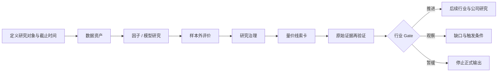

# A 股板块量价研究平台设计

> 文档状态：独立设计文档。
>
> 修订日期：2026-09-01。
>
> 适用范围：A 股行业、主题、风格与上市板块的日频量价观察、因子研究和样本外评价。
>
> 文档边界：本文说明平台在 A 股研究体系中的位置、研究方法、概念架构和成功标准，不规定代码接口、数据表、技术选型或实施步骤。
>
> 声明：平台输出用于发现和验证研究线索，不构成投资建议、交易指令或组合配置方案。

## 阅读入口

- [A股板块量价研究平台架构阅读版.html](./A股板块量价研究平台架构阅读版.html)：优先阅读的可视化导览，用于快速理解平台定位、研究漏斗、核心架构和边界；完整定义以本文为准。

## 1. 结论

板块量价能力应建设成“**发现、排序、再验证**”的研究平台，而不是独立的选股器或交易系统。

平台首先解决三件事：

1. 持续维护可按历史时点重建的板块日频量价数据；默认展示最近 1 年，正式研究使用更长历史。
2. 用统一研究合同承载可扩展的因子、模型和合并方法，并保存完整的实验与评价证据。
3. 把异常信号转化为可继续核验的线索卡、行业 Gate 输入和跟踪任务，而不是直接给出“看多、买入或 Top N”。

平台输出的量价信号属于**市场侧证据**：它可以说明价格是否确认、参与范围是否扩散、流动性是否变化以及市场是否拥挤，但不能单独证明行业需求、盈利、政策兑现、资金身份或估值合理性。

完整能力由四个稳定模块构成：数据资产、研究运行、评价和治理。LLM 只帮助组织研究计划和解释结构化结果，不参与数值计算，不修改正式证据，也不影响每日任务的确定性。



## 2. 在 A 股研究体系中的位置

### 2.1 平台负责什么

板块量价平台连接三个通用研究环节：

| 研究环节 | 平台贡献 | 不替代的能力 |
|---|---|---|
| 市场雷达 | 板块相对强弱、宽度、波动、量能、拥挤和异常状态 | 宏观、政策与全市场风险判断 |
| 行业研究 | 发现景气、估值、资金或事件线索，提供价格确认与跟踪证据 | 产业链、供需、盈利、竞争和估值研究 |
| 策略实验室 | 因子、模型、合并方法、样本外评价和研究治理 | 组合构建、真实交易和风险预算 |

平台应与统一研究流程衔接：

```text
创建线索
→ 定义研究对象、分类与共同信息集
→ 平台计算量价状态和候选信号
→ 形成可验证问题与反方解释
→ 回到官方、原始披露或合法授权数据核验
→ 行业 Gate：推进 / 观察 / 暂缓
→ 后续粗筛、深研、评审、监控和复盘
```

### 2.2 平台不负责什么

- 不把板块涨幅榜当作行业景气榜。
- 不把技术指标、平台评分或 LLM 解释当作基本面事实。
- 不把“主力资金”等供应商算法标签解释为真实投资者身份或因果。
- 不以量价分数自动改变行业 Gate。
- 不输出真实个股 Top N、买卖时点、仓位或组合权重。
- 不用板块指数的未来收益冒充可交易组合收益。

## 3. 研究问题与理论框架

### 3.1 平台真正要寻找什么

行业研究寻找的是**经营事实与市场定价之间的差**。板块收益通常由四类力量共同决定：

| 驱动 | 核心问题 | 量价平台可以观察什么 | 不能直接推出什么 |
|---|---|---|---|
| 基本面变化 | 需求、价格、成本、供给和竞争是否改善 | 价格是否提前或同步确认、参与范围是否扩散 | 上涨本身不能证明景气改善 |
| 预期变化 | 实际路径相对隐含预期是上修还是下修 | 事件前后相对强弱、趋势持续性和分歧 | 强势不能证明盈利预测必然上修 |
| 估值变化 | 市场给予的倍数是否扩张或收缩 | 价格表现与波动结构 | 价格上涨不能证明估值合理 |
| 资金与风险偏好 | 边际定价力量是否支持或透支逻辑 | 成交、换手、宽度、ETF 份额和拥挤线索 | 流量或“资金流”不能证明机构意图 |

因此，平台的主要价值不是生成一个总分，而是帮助回答：

- 当前变化更像景气、政策、估值、资金还是事件驱动？
- 价格确认是广泛扩散，还是由少数权重股贡献？
- 相对强势是否伴随量能、宽度和流动性改善？
- 信号是否已经拥挤，是否仍需要更高等级证据？
- 哪项事实能够证伪当前解释，何时重新检查？

### 3.2 与行业七变量的关系

行业景气分析通常使用“量、价、库存、产能、订单、成本、政策”七个变量。这里的“量、价”主要指产业经营量价，不等同于证券市场的成交量和股价。

板块量价平台提供的是市场侧映射：

```text
行业量、价、库存、产能、订单、成本、政策
            ↓ 经营与预期传导
盈利、现金流、风险溢价和估值变化
            ↓ 市场定价
板块价格、成交、宽度、波动与拥挤度
```

必须保留两条边界：

1. 行业统计量价不等于公司量价，需要经过业务结构和份额映射。
2. 证券市场价格与成交是定价结果和交叉验证，不是行业经营事实本身。

## 4. 研究对象与任务边界

### 4.1 板块类型

不同板块由不同机制驱动，不能静默套用同一研究模型。

| 类型 | 示例 | 主要驱动 | 平台定位 |
|---|---|---|---|
| 行业板块 | 银行、半导体、白酒 | 供需、竞争、利润池和周期 | 正式研究主对象 |
| 产业主题 | 人形机器人、低空经济 | 政策、产业兑现和业务关联度 | 可展示和影子研究；需额外核验主题纯度 |
| 风格板块 | 红利、成长、小盘 | 因子暴露、估值和风险偏好 | 因子比较和市场状态解释 |
| 上市板块 | 主板、科创板、创业板、北交所 | 制度、公司阶段、流动性 | 交易制度和样本边界解释 |

正式研究优先使用具有历史分类与成分关系的稳定行业口径，例如合法取得的申万一级、二级行业。概念和主题板块缺少完整点时成员时，只用于最近状态展示或影子研究，不进入正式因子激活和淘汰。

### 4.2 板块身份

板块名称不是稳定身份。研究对象至少由以下信息共同确定：

```text
提供方 + 分类体系 + 分类版本/有效日 + 层级 + 板块代码
```

跨体系映射是分析近似，不是官方等价关系。需要记录一对一、一对多、多对一或未映射，以及映射依据、差异、适用日期和置信度。平台概念标签只能作为辅助标签，不能覆盖正式分类。

### 4.3 最小研究任务卡

每次研究在计算前冻结：

- 研究对象、类型、分类体系、版本/有效日和不纳入范围；
- 成分股快照、纳入剔除规则和证券状态；
- 研究截止时间、数据截止时间、观察窗口与复查时间；
- 基准、权重方法、复权/总收益口径和 horizon；
- 使用的量价信号、假设、反方解释和失效条件；
- 决定性证据、来源等级、授权状态和待补缺口；
- 当前只允许输出的用途：描述、探索、影子评价或正式研究。

## 5. 从平台信号到行业 Gate

### 5.1 五类研究线索

| 线索类型 | 平台首先观察 | 后续必须核验 | 典型误用 |
|---|---|---|---|
| 景气改善 | 相对强弱、宽度、领涨贡献和趋势 | 产业量、价、库存、订单、产能和成本 | 仅因上涨便断言景气向上 |
| 政策驱动 | 跳空、涨停扩散、事件窗口和持续性 | 正式文件、预算、细则和传导链 | 把讲话或转述当成兑现 |
| 估值修复 | 超额收益、波动收敛和风格共振 | 盈利中枢、资产质量、利率和隐含预期 | 用价格上涨证明低估 |
| 资金扩散 | 成交、换手、宽度、ETF 份额和集中度 | 参与范围、流动性、来源口径和拥挤风险 | 把单日流量视为长期配置 |
| 事件冲击 | 价格跳变、异常量和横截面扩散 | 事件原件、公开时间、影响环节和持续性 | 把旧闻或一次性冲击当作趋势 |

每条线索保存：板块身份、数据时点、触发字段与原值、计算方法、可能解释、反方解释、下一项证据和恢复/失效条件。平台信号只能决定“先查什么”。

### 5.2 基本面、价格确认与拥挤度

价格确认必须记录基准、窗口、收益口径、成交与流动性、宽度扩散，以及停牌、价格限制、指数调样和公司行动的机械影响。

| 基本面证据 | 价格确认 | 拥挤度 | 研究输出 |
|---|---|---|---|
| 改善且可验证 | 广泛确认 | 低/中 | 可提交行业 Gate；仍需由 Gate 决定是否推进 |
| 改善且可验证 | 无或仅少数成分确认 | 低/中 | 观察；补订单、价格、盈利或扩散证据 |
| 改善但证据有限 | 强确认 | 高 | 降低置信度；重点核验叙事、估值和兑现窗口 |
| 恶化或冲突 | 强确认 | 高 | 暂缓或风险复核；价格不能抵消反证 |
| 改善且可验证 | 有确认 | 高 | 提高估值与拥挤复核频率，必要时转观察 |

未列组合不插值打分，默认输出“观察”并补决定性证据。过热不等于立即下跌，低迷不等于立即反转；拥挤度只改变证据门槛和复核频率。

### 5.3 行业 Gate

| 状态 | 最低要求 | 输出 |
|---|---|---|
| 推进 | 对象边界明确，关键数据可验证，存在可解释的景气或预期差 | 允许进入后续行业和公司研究 |
| 观察 | 逻辑可能成立，但数据、政策细则或盈利证据不足 | 缺失证据、跟踪指标和触发条件 |
| 暂缓 | 边界不清、主要由叙事推动、风险不可定价或数据严重冲突 | 记录原因，停止正式排名和下游结论 |

量价平台不自动改变 Gate。它只生成建议输入；正式状态由完整证据链和人工评审决定。

## 6. 概念架构

### 6.1 数据资产

职责：把外部数据转化为可追溯、可按历史时点查询的研究资产。

核心能力：

- 初始化历史数据，之后根据交易日历和局部缺口增量更新；
- 分开保存原始输入、标准化数据和已发布快照；
- 维护分类、成员、行情、复权、交易状态和制度参数的有效时间；
- 对关键字段执行完整性、唯一性、准确性、及时性、一致性、稳定性和可追溯性检查；
- 发现修订或冲突时形成新快照和数据问题，不静默覆盖研究输入；
- 对研究端提供统一数据视图，隐藏供应商和存储细节。

### 6.2 研究运行

职责：把冻结的研究定义和数据快照转化为可追溯的特征、模型预测和合并结果。

研究定义至少包含：

- 假设及经济/行为解释；
- 数据、板块口径和共同信息集；
- 公式或模型、参数族、方向和输入窗口；
- 分支各自的缺失、异常值和标准化规则；
- 预测目标、horizon 和基准；
- 评价协议、失效条件和用途限制。

因子与训练型模型使用不同研究合同：因子是确定性特征；模型还必须保存训练区间、目标、特征、参数选择、随机性和训练产物。二者可以生成统一的预测结果供评价，但不能为了表面统一而隐藏语义差异。

### 6.3 评价

职责：判断因子或模型对未来板块表现的预测力是否稳定，而不是只展示一条最好看的回测曲线。

采用两条证据路径：

1. **历史滚动样本外**：固定训练、验证、隔离和测试区间，合并真正样本外预测。
2. **每日影子评价**：当天生成的预测只登记；horizon 到期后追加真实标签并更新评价。

最低评价维度：

- 覆盖率与缺失结构；
- IC/RankIC、分组表现和单调性；
- horizon 衰减；
- 换手、拥挤和容量代理；
- 不同市场状态和子区间表现；
- 数据质量与特征分布漂移；
- 不确定性、有效样本量和多重检验；
- 全部候选 trial，而不只是优胜参数。

### 6.4 治理

职责：用可审计证据管理因子、模型和合并方法的研究生命周期。

```text
candidate → historical_oos → shadow → active ↔ probation → retired
```

先过硬闸门，再在相同 target、horizon、板块口径、评价协议和因子族内比较。数据质量、未来信息、覆盖率或统计资格等严重缺陷不能被其他高分抵消。任何激活、观察、降级或退役都保留评价证据、规则、原因和人工记录；退役不删除历史研究资产。

## 7. 数据与证据治理

### 7.1 来源等级

证据等级绑定到具体文件、字段、取得路径和当时可得快照，不永久绑定到机构品牌。

| 等级 | 典型材料 | 在平台中的用途 |
|---|---|---|
| L0 法定/监管原件 | 法规、监管决定、交易所公告、法定报告 | 规则、公司行动和监管事实 |
| L1 官方统计/市场基础设施 | 政府统计、海关、交易结算、指数公司原始文件 | 行业总量、市场和指数事实 |
| L2 可追溯一手/授权字段 | 发行人自愿披露、协会原表、可追溯授权接口 | 经营补充与结构化行情数据 |
| L3 方法可核验的派生材料 | 可复算研究、平台派生字段、专业研究 | 交叉验证、假设和解释 |
| L4 摘要、叙事与替代线索 | 新闻摘要、平台叙事、不可核验代理 | 发现问题和待验证线索 |
| L5 未核实信息 | 论坛、自媒体、传闻 | 情绪观察；不进入事实层 |

授权回答“能否以及如何使用”，证据等级回答“字段能证明什么”。获得授权不会提高证据等级；看起来权威但无权使用的数据也不得进入平台。

### 7.2 多源原则

不以单一数据来源作为唯一依据，不等于逐行拼接不同来源。

- 每个数据产品指定正式主源。
- 独立核验源用于差异举证，不参与日常逐行混合。
- 候补源先旁路保存；只有完成语义、重叠区间和许可验收后才能正式切换。
- 同一原始公告、行情或统计经多个前端传播，只算一条事实生产链。
- 适配成功、某次运行采用、许可批准和证据权威性是四个不同判断。
- 差异无法仲裁时并列显示并创建数据问题，不选择更支持当前观点的值。

### 7.3 来源登记

每个来源至少登记：

- 原始生产者与传播渠道；
- 数据集、字段定义、单位、样本和频率；
- `public` 或 `authorized` 权限状态；
- 自动采集、缓存、衍生、展示和再分发边界；
- 事件/观察时间、发布时间、数据截止时间、实际取得时间和有效区间；
- 修订规则、质量检查、当前接入状态和责任人；
- 允许支持的研究用途和禁止推论。

### 7.4 点时与分类

- 历史日只能使用研究截止时间前实际可取得的数据。
- 成分关系同时保存公告时间和生效区间，二者不得混写。
- 今日成员、分类、权重和复权结果不得回填过去。
- 原始 OHLCV 用于事件和未来成交语义；连续价格或明确的总收益口径用于趋势与长期收益研究。
- 交易日历、风险警示、停复牌、价格限制和上市阶段按证券与日期保存。
- 供应商指数行情与基于点时成分自行聚合的板块量价是两个不同产品。

## 8. 数据范围与来源组合

### 8.1 展示与研究分轨

| 用途 | 默认范围 | 定位 |
|---|---:|---|
| 最近状态展示 | 最近 1 年 | 看板、状态变化和线索发现 |
| 因子热启动 | 因子窗口加安全余量 | 由研究定义决定，不能固定为 1 年 |
| 正式历史研究 | 目标 5 年，最低 3 年 | 滚动样本外、多个市场状态和统计检验 |
| 概念板块成员 | 从平台启用日起积累 | 缺少历史成分时只做展示或影子研究 |

### 8.2 关键数据域

- 交易日历和制度参数；
- 板块分类、层级、历史成员和跨体系映射；
- 板块/指数日频 OHLCV；
- 个股未复权行情、复权信息和交易状态；
- 基于点时成员计算的板块宽度、离散度、贡献和量额；
- ETF 份额、融资融券等可核验的市场状态数据；
- 数据质量、缺口、修订、授权和 lineage。

### 8.3 来源角色

| 角色 | 候选 | 使用边界 |
|---|---|---|
| 正式主源 | 合法授权的 Tushare Pro、JQData 或其他许可数据集 | 按具体产品、权限、点时能力和字段口径重新验收 |
| 权威核验 | 交易所、指数公司、政府统计、海关、基金和上市公司法定披露 | 核验规则、样本、指数、状态与产业事实 |
| 独立数据核验 | 第二许可数据商 | 验证关键字段和供应商修订，不静默混源 |
| 原型与线索 | AKShare、东方财富、同花顺等合法可见入口 | 发现和原型；不能自动取得点时完整性或商业再分发资格 |

本文只列候选角色，不证明任何来源已经获得授权、具有完整历史或达到生产服务等级。正式接入时必须重新核实接口、条款、字段、PIT 方法、保存和再分发限制。

## 9. 可扩展研究方法

### 9.1 接入模板

新的因子或模型在进入平台前必须回答：

| 类别 | 必答内容 |
|---|---|
| 研究假设 | 为什么可能存在，属于行为、风险、基本面还是市场结构解释 |
| 对象与用途 | 行业/主题/风格/上市板块；描述、探索、影子或正式研究 |
| 输入与时点 | 字段、来源等级、板块口径、可用时间和最小历史 |
| 方法 | 公式或模型、参数族、方向、变换和缺失规则 |
| 输出 | 特征、预测目标、horizon、基准和解释边界 |
| 评价 | 样本外协议、覆盖、统计检验、子区间和比较组 |
| 风险 | 未来信息、幸存者、制度、成本、拥挤、容量和已知失效条件 |
| 治理 | 进入 shadow/active 的资格和降级、退役条件 |

### 9.2 候选因子族

平台稳定后可按研究假设逐步接入：

| 因子族 | 主要用途 | 关键边界 |
|---|---|---|
| 20/60/120 日截面动量 | 板块相对强弱 | 参数作为同一因子族管理，不能只保留最佳窗口 |
| 5 日短期反转 | 超跌后的短期预测 | 对价格限制、成交成本和时点最敏感 |
| 52 周高点接近度 | 趋势锚定 | 至少需要约 252 个交易日热启动 |
| 实现波动率 | 风险状态和缩放 | 停牌填充会虚假压低波动率 |
| 相对强度与趋势状态 | 市场侧价格确认 | 不能升级基本面状态 |
| 异常量与换手 | 量能变化和拥挤 | 先统一量额、样本和流通盘口径 |
| Amihud 非流动性 | 流动性代理 | 成交额单位和板块聚合口径必须一致 |
| 板块宽度与成分离散度 | 扩散和集中度 | 必须使用点时成员并明确停牌分母 |

这些方法是候选假设，不是预先承诺有效的策略。平台建设阶段只需要少量透明方法验证研究合同和评价闭环，不以因子数量作为完成标准。

### 9.3 合并方法

- 每个 horizon 单独合并，不生成无明确时域的总分。
- 输入先按各自研究合同标准化，并保留原始值和贡献。
- 等权 rank 作为透明基线；评价加权只能使用当时已经成熟并发布的证据。
- 历史日期不能读取今天最新的 IC 或治理结果。
- LLM 不得自由决定正式权重。

## 10. 预测评价与交易模拟

### 10.1 平台当前评价什么

平台评价：历史时点产生的板块分数，是否与未来板块相对表现具有稳定关系。

它可以输出 RankIC、分组单调性、horizon 衰减、覆盖率、漂移、置信区间和不同市场状态表现。

### 10.2 平台当前不评价什么

板块指数未来收益不是可交易组合收益。真实组合模拟还需要：

- 把板块预测映射为 ETF 或点时成分股；
- 使用真实未复权价格；
- 处理 T+1、停牌、复牌、涨跌停、费用、滑点和容量；
- 维护订单、成交、持仓和现金；
- 同时报告毛收益、成本后收益、成交率和未成交原因。

组合模拟属于独立能力，不能用一个简化收益曲线替代。

## 11. 每日输出与复盘

### 11.1 每日顺序

```text
更新并发布数据快照
→ 结算已经到期的历史预测
→ 更新样本外评价
→ 运行冻结的 active / shadow 研究
→ 发布最近一年状态、线索卡、质量和心跳
```

必须先结算旧预测，再生成当天预测；当天预测的真实标签只能在未来到期后追加。

### 11.2 量价线索卡

每条输出至少包含：

- 板块身份、分类与成分快照；
- 数据截止和研究截止时间；
- 当前触发信号、原始值、窗口、基准与口径；
- 宽度、贡献集中度、量能、波动和拥挤状态；
- 可能解释、反方解释和不可推出的结论；
- 证据类型：事实、平台算法、研究估计或观点；
- 来源等级、数据质量、覆盖和冲突；
- 下一项核验材料、复查时间和失效条件；
- 当前用途和 Gate 建议：推进候选、观察或暂缓候选。

### 11.3 复盘

复盘至少区分：数据错误、口径错误、逻辑错误、时点错误、模型不稳定、制度影响和不可预见事件。复盘的目的不是为结果补解释，而是更新研究假设、数据质量、Gate 规则和后续监控。

## 12. LLM 边界

LLM 可以：

- 根据自然语言任务和能力目录生成研究计划草案；
- 帮助分类线索、发现冲突、生成反方问题和检查清单；
- 把代码已经计算的结构化结果转成带限制的文字解释；
- 草拟线索卡和后续核验任务。

LLM 不得：

- 计算或补造量价、财务、政策和评价数字；
- 把推断显示为事实或提高证据等级；
- 引用未注册方法或绕过数据、样本和 Gate 约束；
- 自动修改基础数据、正式研究状态或评价结果；
- 生成并执行交易指令；
- 读取或传播超出许可、保密和隐私边界的数据。

已确认的研究计划应脱离 LLM 确定性运行。LLM 不可用时，数据更新、冻结研究、评价和报告继续工作。

## 13. 失败与降级

- 数据缺失或冲突达到阻断级别：不发布正式快照，不生成新正式预测。
- 数据尚未更新：报告 `STALE`，保留最后成功时点，不把旧数据冒充新结果。
- 单个因子或模型失败：隔离该研究，其他研究继续。
- 来源访问失败、许可未知或未授权：保留真实状态，不能补写为成功。
- 概念板块缺点时历史：只做展示或影子研究。
- 决定性证据不足：输出观察或暂缓，以及恢复研究所需证据。
- LLM 计划不合法：返回约束错误，不静默运行无关默认任务。

## 14. 成功标准

平台设计成立需满足以下可观察结果：

1. 最近 1 年板块状态可以稳定展示，正式研究历史和因子热启动区间独立管理。
2. 任意历史日可以重建当时的分类、成分、行情可用状态和研究输入。
3. 每个关键数据域都能说明主源、核验源、原始生产者、授权范围和证据用途。
4. 主源故障不会把不同语义的候补记录静默混入原序列。
5. 新研究方法使用统一模板接入，不改变平台核心模块。
6. 所有预测明确对象、horizon、基准、数据截止时间和来源证据。
7. 未成熟预测、未来数据、当前成员回填和未来评价权重不能进入历史评价。
8. 排名只发生在可比较对象之间；严重缺陷不能被加权总分抵消。
9. 量价输出始终表现为线索、价格确认或风险状态，不冒充基本面事实和交易建议。
10. 每条重要结论都能回到数据快照、计算方法、证据等级、反方解释和失效条件。
11. LLM 断开后，冻结研究和每日更新仍能确定性运行。
12. HTML 阅读版与本文使用相同术语、边界和研究流程。

## 15. 一手来源附录

### 15.1 市场、指数和数据接口

- 上交所：[Trading Mechanism](https://english.sse.com.cn/start/trading/mechanism/)
- 深交所：[Trading Overview](https://www.szse.cn/English/services/trading/tradOverview/index.html)、[Trading Calendar](https://www.szse.cn/English/services/trading/calendar/index.html)、[Trading Fees](https://www.szse.cn/English/services/trading/tradingFees/index.html)
- 中证指数：[指数详情](https://www.csindex.com.cn/#/indices/family/list)、[指数样本服务](https://www.csindex.com.cn/#/dataService/indexConstituent)
- Tushare Pro：[日线](https://tushare.pro/document/2?doc_id=27)、[复权因子](https://tushare.pro/document/2?doc_id=28)、[交易日历](https://tushare.pro/document/2?doc_id=26)、[指数日线](https://tushare.pro/document/2?doc_id=95)、[申万分类](https://tushare.pro/document/2?doc_id=181)、[申万成分](https://tushare.pro/document/2?doc_id=335)、[同花顺板块](https://tushare.pro/document/2?doc_id=259)、[板块日线](https://tushare.pro/document/2?doc_id=260)、[板块成分](https://tushare.pro/document/2?doc_id=261)、[停复牌](https://tushare.pro/document/2?doc_id=214)、[涨跌停价](https://tushare.pro/document/2?doc_id=183)
- JQData：[官方 SDK README](https://github.com/JoinQuant/jqdatasdk/blob/master/README.md)、[官方 API 源码](https://github.com/JoinQuant/jqdatasdk/blob/master/jqdatasdk/api.py)
- AKShare：[A 股历史行情](https://akshare.akfamily.xyz/data/stock/stock.html#id24)、[概念板块](https://akshare.akfamily.xyz/data/stock/stock.html#id370)、[行业板块](https://akshare.akfamily.xyz/data/stock/stock.html#id379)

### 15.2 因子与统计方法

- Jegadeesh & Titman (1993), *Returns to Buying Winners and Selling Losers*：[DOI](https://doi.org/10.1111/j.1540-6261.1993.tb04702.x)
- Moskowitz, Ooi & Pedersen (2012), *Time Series Momentum*：[DOI](https://doi.org/10.1016/j.jfineco.2011.11.003)
- Jegadeesh (1990), *Evidence of Predictable Behavior of Security Returns*：[DOI](https://doi.org/10.1111/j.1540-6261.1990.tb05110.x)
- George & Hwang (2004), *The 52-Week High and Momentum Investing*：[DOI](https://doi.org/10.1111/j.1540-6261.2004.00695.x)
- Amihud (2002), *Illiquidity and Stock Returns*：[DOI](https://doi.org/10.1016/S1386-4181(01)00024-6)
- Lee & Swaminathan (2000), *Price Momentum and Trading Volume*：[DOI](https://doi.org/10.1111/0022-1082.00280)
- Parkinson (1980), *The Extreme Value Method for Estimating the Variance of the Rate of Return*：[DOI](https://doi.org/10.1086/296071)
- Shumway (1997), *The Delisting Bias in CRSP Data*：[DOI](https://doi.org/10.1111/j.1540-6261.1997.tb03818.x)
- Bailey et al., *The Probability of Backtest Overfitting*：[SSRN](https://papers.ssrn.com/sol3/papers.cfm?abstract_id=2326253)
- Harvey, Liu & Zhu (2016), *… and the Cross-Section of Expected Returns*：[DOI](https://doi.org/10.1093/rfs/hhu075)

外部论文证明的是其特定市场、样本、频率和定义下的结果。将方法用于 A 股板块只能形成待验证假设，不能直接继承原结论或参数。
