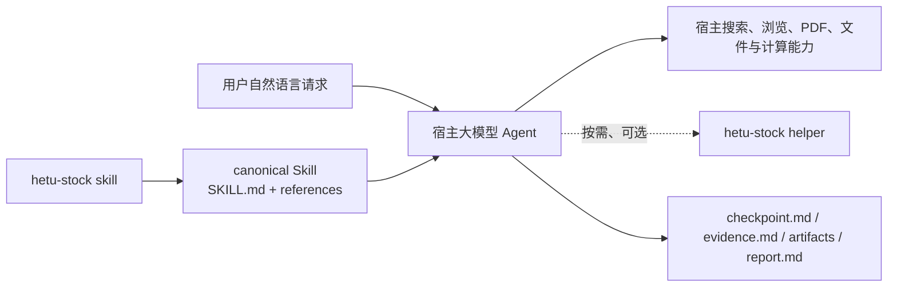

# HETU 个股分析工作流 V1 一期实现

> 文档版本：V1 一期实现 v1.2
> 文档状态：V1 一期实现说明；随实现同步维护
> 创建日期：2026-08-17
> 修订日期：2026-08-26
> v1.2 修订依据：2026-08-17 用户将现行实现归入 V1 系列：本文档为 V1 一期实现；二期加固
> 与 V1 长期需求另行成文；方法论移至 docs/
> 适用范围：V0.1 未发布版本的 canonical Skill、Python 辅助工具、CLI、安装与工程门禁
> 权威顺序：canonical Skill 与源码 > 当前测试 > 本文档
> 后续需求：[二期实现](2026-08-25-stock-analysis-workflow-v1-phase-2-implementation.md)、
> [V1 长期需求](stock-analysis-workflow-v1-requirements.md)

---

## 0. 当前结论

HETU 当前是一个由大模型 Agent 主导的单只中国 A 股研究 Skill，不是 Python 研究引擎。用户在
Codex、OpenCode 或其他具备所需能力的宿主中用自然语言发起研究；canonical
`hetu-stock-analysis` Skill 规定任务边界、证据规则、W0–W10 工作包、失败恢复和报告交付。
Agent 负责理解、规划、检索、语义判断、冲突处理和写作。

Python 只保留四类确定性能力：

1. 校验 canonical Skill 的文件、链接、工作包和 manifest 契约；
2. 将同一 Skill 包安装到 Codex、Claude Code 或 OpenCode 的用户目录；
3. 判断一条来源时间是否越过 `as_of`；
4. 判断一次 authorized 数据请求是否满足登记、用户范围、点时、secret 引用和许可约束。

历史工作流的固定 S0–S9 状态机、业务模型、正则语义门禁、Jinja 报告渲染和 legacy CLI 已不存在。
历史开发期的 acceptance harness、迁移账本、fixture 和历史结果包也已不存在。当前
仓库不依赖这些结构运行或验证产品。

本文档合并历史各阶段中仍然成立的需求、设计和已落地质量保护，作为一期实现的权威说明；阶段
过程、执行日志、旧测试数量、旧目录树和已失效命令不属于当前实现，也不保留旧的阶段编号叙事。

## 1. 系统上下文与职责边界

### 1.1 运行关系



概念上的研究控制面是 Agent 与 Skill；数据面是宿主工具取得的公开或明确授权材料；Python helper
只接收一次调用所需的显式输入，不知道完整研究状态，也不决定下一步。

### 1.2 当前支持范围

- 只支持一个中国 A 股证券的公司研究；输入可为明确公司名称、6 位代码，或大写
  `.SH`、`.SZ`、`.BJ` 后缀代码。
- 支持 `public` 和 `authorized` 两种数据模式；默认 `public`。
- 任务卡包含研究深度，默认 `standard`；`quick`、`standard`、`deep` 三档的固定内容定义和
  输出模板尚未实现，属于二期加固。
- 默认 `as_of` 是带时区的任务发起时点，默认关注点是基础全面覆盖，默认交付 Markdown 报告。
- 行业或板块单独研究、多股比较、组合、非 A 股、自动交易和纯订单执行不适用。
- 不接真实交易接口，不输出直接买卖、仓位动作、收益承诺或无证据确定性结论。

适用性只由 `skills/hetu-stock-analysis/SKILL.md` 首段判断。命中排除项后，Agent 必须停止本
Skill，不继续加载工作包或检索数据。证券或范围存在歧义、`as_of` 无效或在未来、新增授权、
高等级核心事实冲突无法裁决、交易状态异常或存在安全风险时，Agent 暂停并请求用户决定。

### 1.3 权责矩阵

| 职责 | 当前所有者 | Python 是否裁决 |
|---|---|---|
| 请求理解、证券核验与研究规划 | Agent + canonical Skill | 否 |
| 来源选择、语义解释、冲突与缺口影响 | Agent | 否 |
| 工作包选择、交错、回访与完成判断 | Agent | 否 |
| 事实、计算、预测、判断和未知分类 | Agent | 否 |
| 最终报告内容与发布自检 | Agent | 否 |
| Skill 结构、链接、工作包与哈希完整性 | `hetu_stock.skill` | 是，仅机械契约 |
| 时间边界与 authorized 单次请求判断 | `hetu_stock.helpers` | 是，仅显式输入 |
| 搜索、浏览、PDF、文件和计算 | 宿主工具 | 否 |

大模型不可用时任务终止，不回退到规则引擎。helper 不可用时，public 研究可使用宿主等价工具
继续；authorized 检查或来源失败只阻塞相关数据，不能静默切换为 public。

## 2. 当前代码与依赖

### 2.1 经过筛选的目录

```text
HETU/
├── skills/hetu-stock-analysis/       # 研究行为的 canonical owner
│   ├── SKILL.md
│   ├── MANIFEST.json
│   └── references/                   # 证据、编排、恢复、报告与 W0–W10
├── src/hetu_stock/
│   ├── cli.py                        # 两个命令组的薄装配层
│   ├── helpers/
│   │   ├── time.py                   # 点时判断
│   │   └── authorization.py          # authorized 单次请求判断
│   └── skill/
│       ├── package.py                # Skill 结构和链接校验
│       ├── work_packages.py          # 工作包与 catalog 契约
│       └── installer.py              # manifest 与复制安装
├── scripts/
│   ├── install.sh                    # 用户级一键安装
│   ├── check.sh                      # 完整仓库门禁
│   ├── check_docs.py                 # 文档链接和旧命令检查
│   └── update_skill_manifest.py      # canonical manifest 生成
├── tests/product/                    # 当前产品、Skill、安装和文档契约
├── tests/helpers/                    # 两个原子 helper
└── config/data_sources.example.yaml  # authorized registry 示例
```

财务报表、公告索引和数值一致性候选曾存在于 Git 提交 `94c4438`；三项确定性能力已由二期
canonical 脚本吸收，历史目录现已退役。CLI、Skill、helper 和安装器不依赖该历史目录；当前
能力以 canonical 入口和现行测试为准。

### 2.2 运行依赖

| 依赖 | 当前用途 |
|---|---|
| Python `>=3.11,<3.13` | CLI、Skill 管理和 helper 运行时 |
| Typer | `hetu-stock` 命令树和参数解析 |
| Pydantic | helper 输入、决定对象及安全错误规范化 |
| PyYAML | Skill/work-package frontmatter 与授权 registry |
| markdown-it-py | Skill 链接、catalog 和文档结构解析 |

开发依赖只有 pytest、Ruff 和 mypy。当前包不依赖 Jinja、业务状态机、行情 SDK、数据库、任务
队列或 LLM SDK；研究数据访问由宿主能力承担。

## 3. 能力地图

| 能力 | 真实入口 | 关键阶段 | 输出或消费者 | 接线状态 | canonical owner 与证据 |
|---|---|---|---|---|---|
| 单股研究 | 宿主中的自然语言请求 | 适用性 → W0/W1 → W2–W9 → W10 | 研究目录与用户最终消息 | 已接线；宿主认证仍未完成 | `skills/hetu-stock-analysis/SKILL.md`；`tests/product/skill/test_prompt_*.py` |
| Skill 校验 | `hetu-stock skill validate PATH` | 包结构 → 工作包 → 链接 → manifest | 成功消息或退出码 1 | 已接线 | `src/hetu_stock/cli.py`、`skill/package.py`、`skill/work_packages.py`；Skill contract tests |
| Skill 安装 | `hetu-stock skill install` | 源校验 → 目标选择 → 复制 → 目标复验 | 宿主 Skill 目录 | 已接线 | `skill/installer.py`；`tests/product/skill/test_installer.py` |
| 一键安装 | `scripts/install.sh --host ...` | Python/平台检查 → venv/pip → launcher → Skill 安装与复验 | 用户级 CLI 与 Skill | 已接线 | `scripts/install.sh`；`tests/product/install/test_install_script.py` |
| 时间边界 | `hetu-stock helper time-boundary` | 解析 → 时区归一 → 点时比较 | JSON decision | 已接线，可选 | `helpers/time.py`；`tests/helpers/test_time.py` |
| 授权判断 | `hetu-stock helper authorization-check` | YAML/JSON 解析 → 封闭 schema → 14 类检查 | JSON decision | 已接线，可选 | `helpers/authorization.py`；authorization tests |
| 三项确定性能力 | `skills/hetu-stock-analysis/scripts/` | 显式保存输入的标准化、索引与数值复算 | 研究产物中的局部确定性结果 | 已接线，可选 | `financial_statements.py`、`announcement_index.py`、`numeric_consistency.py` 及现行产品测试 |
| 原生宿主认证 | 无当前执行器 | 无 | README 版本状态表与使用指南 | `UNVERIFIED` | 三宿主均未认证；旧 harness 已删除，仅 Git 历史追溯 |

每项当前能力只有一个 owner：研究行为归 canonical Skill，确定性实现归对应 Python 模块，安装
细节归安装器实现，未实施增强归二期加固或 V1 需求。本文不复制未来需求为当前能力。

## 4. Agent 研究流程

### 4.1 真实入口与主线

真实入口是宿主 Agent 对用户自然语言请求的 Skill 触发，不是 `hetu-stock run`。主线为：

```text
用户请求
  → SKILL.md 适用性判断
  → 读取 orchestration、evidence-rules、catalog
  → W0 候选任务卡与 checkpoint.md
  → W1 证券、发行人与交易状态核验
  → W2–W9 按依赖、证据和工具能力自由编排并按需回访
  → W10 直接写 report.md，完成研究自检和安全自检
  → 最终消息呈现报告或提供可打开的 report.md
```

仓库不包含宿主 Agent 的执行器，因此“某个宿主一定按此链运行”不能由本地源码证明。当前三个
宿主的正式认证均为 `UNVERIFIED`；安装成功、静态提示词测试和一次人工主链均不能替代认证。

### 4.2 W0–W10 阶段契约

编号用于定位和覆盖，不代表固定顺序。

| 包 | 目标 | 关键依赖与边界 | 主要产物 |
|---|---|---|---|
| W0 | 界定证券、`as_of`、模式、深度、关注点和交付 | 无；证券先标记待核验 | 候选/正式任务卡 |
| W1 | 核验证券、发行人、板块、上市和交易状态 | W0 已定稿；歧义或异常时暂停 | 主体与状态证据 |
| W2 | 检查基准披露后至 `as_of` 的重大事件 | W1；与 W5 共用最新披露基准 | 公告与事件影响 |
| W3 | 研究行业、竞争和政策 | W1 | 行业边界、支持与反证 |
| W4 | 研究业务、治理、审计和资本配置 | W1 | 经营与治理事实 |
| W5 | 验证财务趋势、现金质量和经营解释 | W1；与 W2 共用基准 | 财务事实、计算与冲突 |
| W6 | 形成预测、情景或无法预测的边界 | W1；定稿依赖 W2–W5 | 变量、情景与不确定性 |
| W7 | 形成估值参照或最小缺失输入 | W1；定稿依赖 W5、W6、W8 | 估值输入、方法和限制 |
| W8 | 核对价格、股本、市值、成交和交易状态 | W1 | 同时点市场数据 |
| W9 | 综合支持、反证、未知、条件和监控 | W1；定稿依赖 W2–W8 | 论点与监控语义 |
| W10 | 写报告并执行研究、安全两轮自检 | W9 已覆盖；定稿依赖 W0–W9 | `report.md` 与交付 |

W2 与 W5 是共享基准，不是顺序依赖。新证据命中 `may_reopen` 时，Agent 撤销受影响终态，递归
重开下游并保留原结论、失败和用户决定。Python 只校验元数据、catalog、依赖无环和 manifest
覆盖，不执行依赖、回访、覆盖状态或 `required_when`。

### 4.3 研究数据形态与产物

默认工作区为 `.hetu/research/<证券>-<任务时间>/`：

| 产物 | 内容与消费者 | 约束 |
|---|---|---|
| `checkpoint.md` | Agent 的任务卡、工作包状态、事实/判断/冲突/未知、替代、用户决定和自检摘要 | 人类可读；不是状态机，不含隐藏思维链或 secret |
| `evidence.md` | 来源、五类时间、等级、授权、主张、计算、冲突与未采用原因 | 关键事实须可定位；内部 ID 不能替代用户引用 |
| `artifacts/` | 合法取得、许可允许且确有复核价值的任务材料 | 不保存无关材料、secret 或受限内容 |
| `report.md` | Agent 直接撰写的最终中文 Markdown 报告 | 不由 Python/Jinja 选择、拼接或语义批准 |

数据从不可信网页、PDF、表格或工具输出进入 `evidence.md` 前，必须经过来源、时点、许可、主体、
期间、范围和冲突判断；报告只消费仍有效证据。写入文件不等于交付，最终用户消息还必须呈现报告
或给出可打开位置。

### 4.4 失败、暂停与恢复

- 单个来源、PDF、网页、工具或 helper 失败：先分类并尝试至少一种合法替代；非关键项仍失败则
  记录缺口、传播影响并继续不受影响的研究。
- authorized 权限或来源失败：只阻塞相关数据，保持 authorized；是否重试、切 public 或终止
  必须由用户明确决定。
- 主体、范围、未来 `as_of`、新增授权、无法裁决的高等级核心冲突、异常交易状态或安全风险：
  强制暂停。
- 同一任务恢复：读取原 `checkpoint.md` 和 `evidence.md`，复核任务、授权与来源有效性，保留
  原失败和决定，再由 Agent 选择继续或重开。
- 阻断问题未解决：W10 保持进行中，不交付；非阻断缺口可以在明确影响并收缩结论后交付。

跨任务完整恢复、动态改范围、预算、取消和正式子 Agent 并行不是当前承诺，属于 V1。

## 5. 已落地的证据与语义质量保护

当前 canonical Skill 已包含以下保护，不需要恢复历史质量加固计划：

1. 重大量化事实必须闭合主体、指标、数值与单位、期间或基准日、报表范围和来源定位；日期会
   改变含义时同时记录日期。
2. 历史追溯调整、重述、更正或同一控制下合并统一使用截至 `as_of` 最新 L0 披露的调整后
   可比列；调整前、旧披露和调整后列不得混成趋势。
3. 比率和增长率保留字段与单位语义；有绝对值时独立复算，百分数、小数和基点不得混用。
4. 子公司数据不得写成集团贡献；单体、合并、分部、全年、季度、购买日至期末等范围不得互换。
5. 并购分析区分标的全年数据、交易与控制日期、实际并表日期和购买日至期末贡献。
6. 关键词、页码命中和截断摘要只用于导航，不能证明完整覆盖；重大主张无法闭合时删除、标为
   未知、降低工作包覆盖，或阻断 W10。
7. W10 对关键主张逐条复核主体、指标、数值、单位、期间/基准日、范围和来源，并对关键比率、
   增长率和趋势独立复算。
8. 监控项必须保持指标、分母、方向、窗口、连续期、期间、来源、阈值依据、AND/OR 与复查动作
   一致；会改变结果的歧义未确认前只能保留为草案。

这些规则由 `references/evidence-rules.md`、W4、W10 和
`tests/product/skill/test_prompt_resources.py` 共同保护。静态测试证明批准语义仍存在，不证明
任意模型生成的报告必然无错；报告事实正确性仍需 W10 和真实报告复核。固定三档输出模板、稳定
信息量和后续盲测约束属于二期加固。

## 6. CLI 与 Skill 包管理

### 6.1 命令树

`hetu-stock` 只有四个叶子命令：

```text
hetu-stock
├── skill
│   ├── validate
│   └── install
└── helper
    ├── time-boundary
    └── authorization-check
```

`src/hetu_stock/cli.py` 只装配 `skill` 和 `helper`。helper 实现使用局部导入，根帮助和其他命令
不会加载授权或时间实现；旧 `run`、`report`、`schema`、`request` 和 `legacy` 均未注册。

### 6.2 Skill 校验调用链

```text
validate_skill()
  → validate_skill_package(require_manifest=True)
    → validate_phase2_frontmatter()
    → _load_manifest_files()
    → validate_work_package_contract(expected_official_count=0)
      → load_work_package() × W0–W10
      → _validate_no_cycles()
      → _catalog_entries()
    → _extract_targets()
  → verify_skill_manifest()
```

阶段契约如下：

| 阶段 | 输入 | 决策与副作用 | 输出/错误 |
|---|---|---|---|
| CLI 包装 | 路径 | 不改文件；归一化 OSError、UnicodeError 和 `SkillValidationError` | 成功文本或退出码 1 |
| 包结构 | Skill 根目录 | 要求闭合 frontmatter、准确 name/description、SKILL.md 位于根内 | 无返回；失败抛 `SkillValidationError` |
| 工作包 | catalog、W0–W10、可选 official 目录 | 要求准确核心集合、字段/章节、依赖、共享基准、回访说明、catalog 一致和无环 | 当前 official 扩展数必须为 0 |
| 链接 | SKILL.md 正文 | 禁止 file、绝对路径、Windows 路径、越界和缺失文件 | 外部 URL 不作本地文件检查 |
| manifest | 所有包内文件 | 禁止符号链接；比较文件集合和逐文件 SHA-256 | manifest 自身不进入哈希集合 |

校验器不读取研究报告，不执行 W0–W10，也不判断自然语言研究是否充分或正确。

### 6.3 Skill 安装调用链

```text
install_skill_command()
  → default_user_skill_root()
  → install_skill()
    → verify_skill_manifest(source)
    → validate_skill_package(source, require_manifest=True)
    → copytree(source, target)
    → validate_skill_package(target, require_manifest=True)
    → verify_skill_manifest(target)
```

默认根目录分别为 `$CODEX_HOME/skills`（否则 `~/.codex/skills`）、`~/.claude/skills` 和
`$XDG_CONFIG_HOME/opencode/skills`（否则 `~/.config/opencode/skills`），目标目录名固定为
`hetu-stock-analysis`。

安装前后均校验结构和 manifest。目标已存在且未传 `--force` 时拒绝覆盖；传入 `--force` 时，
当前实现先删除旧目标再复制。复制后的校验失败会删除新目标，但不会恢复被删除的旧目标，因此
当前覆盖不是原子替换，也没有备份/回滚。该限制的治理归入 V1 安装治理范围。

### 6.4 一键安装

`scripts/install.sh` 只支持 macOS/Linux。它验证宿主、Git、Python 3.11/3.12、venv、pip 和
canonical Skill 文件，随后：

1. 在 `${XDG_DATA_HOME:-$HOME/.local/share}/hetu-stock/venv` 创建或复用受管环境；
2. 从当前仓库通过 pip 安装 CLI 和 helper；
3. 只在 `$HOME/.local/bin/hetu-stock` 不存在或已经指向受管 CLI 时创建链接；
4. 校验源 Skill，调用 `skill install`，再校验目标 Skill 和根帮助。

脚本不使用 `sudo`，不修改 shell 启动文件，不绕过 TLS。具体布局、覆盖语义和非目标以本文
第 6 节为准；原独立安装器设计已删除，经 Git 历史追溯。

## 7. 原子 helper 实现

### 7.1 时间边界

入口为 `run_time_boundary()`，调用 `evaluate_availability_json()` 解析字符串，再调用
`evaluate_availability()`：

```text
CLI 字符串
  → ISO datetime/date 解析
  → as_of 归一到 UTC
  → timestamp：published_at 归一到 UTC 后直接比较
     date-only：按 source_timezone 取得 as_of 本地日期后比较
  → AvailabilityDecision JSON
```

timestamp 等于 `as_of` 时可用；date-only 早于本地日期时可用，晚于时不可用，同一自然日因时间
未知返回 `date-only-same-day-unknown` 且 `admissible=false`。naive datetime、未知时区、日期未
显式使用 `--date-only` 和时区换算越界均失败。函数无持久化、网络或研究状态副作用。

### 7.2 authorized 判断

入口为 `run_authorization_check()`，调用链为：

```text
registry YAML + request JSON
  → _load_registry() / _load_request()
  → Pydantic 封闭、冻结 schema 与安全错误规范化
  → evaluate_authorization()
  → AuthorizationDecision JSON
```

`evaluate_authorization()` 按固定顺序检查来源存在/启用、授权有效期、数据集、用户来源与数据集
范围、PIT、secret 引用匹配与解析状态、purpose、许可声明，以及无法可靠恢复的操作失败或限流。
它返回全部命中的 finding；只有 finding 为空时 `allowed=true`。

有效期使用 `checked_at`，不是研究 `as_of`。`as_of` 作为请求字段参与授权语境，但不替代当前
授权有效性检查。操作失败或限流在 `reliable_recovery_available=true` 时不产生对应 finding，
因为调用方仍有可靠外部恢复路径。

所有公开输入模型均禁止额外字段、要求带时区时间和 `secret://` 非空引用，并对验证错误中的
输入值、动态来源键、未知字段和异常上下文做脱敏。helper 不解析 secret、不保存 registry 或
request，也不决定整次研究是否继续；Agent 仍负责把单个数据失败传播到相关结论。

## 8. 失败与副作用边界

| 流程 | 可恢复失败 | 不可自动补偿的失败 | 外部副作用 |
|---|---|---|---|
| Agent 研究 | 单来源/工具失败可合法替代或局部降级 | 身份、未来点时、核心无来源、授权/secret、安全或不可裁决冲突 | 写研究目录并向用户交付 |
| Skill 校验 | 无；修正包后重跑 | 结构、链接、工作包或 manifest 不一致 | 无 |
| Skill 安装 | 新复制校验失败时删除新目标 | `--force` 已删除旧目标后失败不会自动恢复 | 创建/删除宿主 Skill 目录 |
| 一键安装 | 明确环境问题后可重跑 | 非受管 launcher、TLS、Python/venv/pip 或 Skill 校验失败 | venv、launcher、Skill 目录 |
| 时间 helper | 修正显式输入后重跑 | 无隐式猜测或同日 date-only 放行 | 无 |
| 授权 helper | 修正 registry/request 或外部状态后重跑 | 不切 public、不扩大授权、不解析 secret | 无 |

## 9. 测试与仓库门禁

当前完整门禁是：

```bash
bash scripts/check.sh
```

它按顺序执行测试收集、`tests/product` 与 `tests/helpers`、Ruff、mypy、Markdown 链接和当前旧命令
检查、manifest 重建无差异、canonical Skill 校验及 `git diff --check`。主要保护面包括：

- CLI 精确叶子集合、旧入口缺席和导入边界；
- canonical Skill frontmatter、链接、W0–W10、catalog、扩展协议和 prompt 关键义务；
- manifest 文件集合、SHA-256、符号链接拒绝、安装前后校验和三宿主复制一致性；
- 时间边界的时区、同日 date-only 保守语义和错误不回显输入；
- authorized 的完整 finding、有效期、PIT、许可、secret 引用和验证错误脱敏；
- README、使用文档、宿主状态、当前 CLI 描述和 Markdown 链接。

自动门禁证明机械契约和测试覆盖的行为，不证明真实宿主已经认证，也不证明任意生成报告事实
全部正确。真实报告质量仍需要模型运行与人工/独立复核。

## 10. 已删除能力与不存在结构

以下名称只用于明确负边界，不能作为当前入口、恢复方案或设计依赖：

- `src/hetu_stock/workflow/`、`models/`、`report/`、`config/`、`legacy_cli.py`；
- `WorkflowEngine`、`RunState`、固定 `StageResult`、S0–S9 Python 状态机；
- Python 正则业务语义门禁、Jinja 报告选择/拼接/渲染；
- `hetu-stock run`、`report`、`schema`、`request`、`legacy` 命令组；
- `tests/legacy/`、`tests/frozen/`、Phase 2 acceptance suite、conductor、fixture、结果 schema、
  迁移账本和已提交结果包；
- 当前可执行的宿主认证流程和已通过宿主声明。

历史实现和执行证据只通过 Git 历史追溯，不在当前仓库复制归档。长期可复用的代码精简原则见
[代码简化方法论](../docs/engineering/code-reduction-methodology.md)。尚未实施但仍有
价值的质量加固能力已并入[二期实现](2026-08-25-stock-analysis-workflow-v1-phase-2-implementation.md)
与[V1 长期需求](stock-analysis-workflow-v1-requirements.md)。

## 11. 当前限制与后续边界

### 11.1 明确限制

- Codex、OpenCode、Claude Code 的正式支持状态均为 `UNVERIFIED`。
- 报告章节只有内容下界，没有 quick/standard/deep 的固定编号模板。
- 来源完整度、行业专用经营模型、复杂恢复、正式并行、长任务控制和跨宿主稳定性未实现。
- Skill 覆盖安装不是原子替换，失败不恢复旧版本。
- 已退役历史候选不构成当前能力或运行依赖；其演进只在 Git 历史中追溯。

### 11.2 后续唯一落点

- 二期加固：固定编号报告骨架、三档模板、核心发现表、空值/缺口语义与报告事实零错误门禁；
  已接线确定性能力的后续变更仍须由 canonical owner 与现行测试共同约束。
- V1：来源与信息完整度、经营/会计模型适配、主/子 Agent 协作、复杂任务控制、安全与宿主
  认证、安装原子性和工作包扩展治理。

后续实现不得恢复中央 Python 研究流程，也不能把模板、helper 或评测器变成业务内容裁决者。

## 12. 维护者导航与证据

### 12.1 三种阅读路径

- 30 秒：第 0、1、3、11 节，确认产品定位、能力和限制。
- 5 分钟：第 4、5、6、7 节，理解研究、质量保护、CLI 和 helper。
- 维护下钻：从第 3 节能力地图进入对应源码和测试，再运行第 9 节完整门禁。

### 12.2 关键源码与测试

| 主题 | 源码/契约 | 主要测试 |
|---|---|---|
| 研究主线 | `skills/hetu-stock-analysis/SKILL.md`、`references/orchestration.md` | `tests/product/skill/test_prompt_contract.py`、`test_prompt_resources.py` |
| 证据和报告 | `references/evidence-rules.md`、`report-guidance.md`、W4/W5/W9/W10 | `test_prompt_resources.py` |
| Skill 校验 | `src/hetu_stock/skill/package.py`、`work_packages.py` | `test_skill_package.py`、`test_work_package_contract.py` |
| Skill 安装 | `src/hetu_stock/skill/installer.py`、`scripts/install.sh` | `test_installer.py`、`test_install_script.py` |
| 时间 helper | `src/hetu_stock/helpers/time.py` | `tests/helpers/test_time.py`、`test_cli.py` |
| 授权 helper | `src/hetu_stock/helpers/authorization.py` | `tests/helpers/test_authorization*.py` |
| 公共入口与消失证明 | `src/hetu_stock/cli.py`、`pyproject.toml` | CLI、import-boundary、docs tests |

源码、测试或 canonical Skill 变化时，先更新对应 owner，再同步本文；若本文与可执行事实冲突，
以源码、Skill 和最新门禁结果为准，并修正文档。
